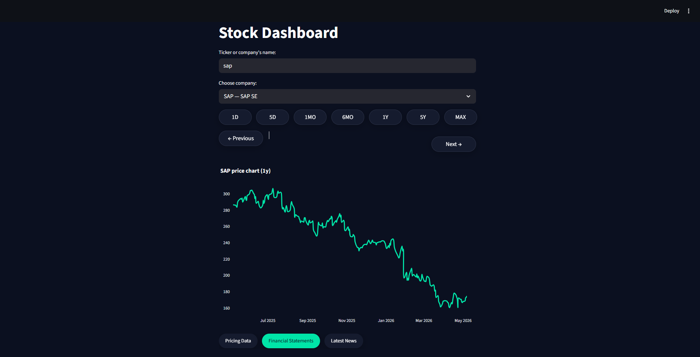
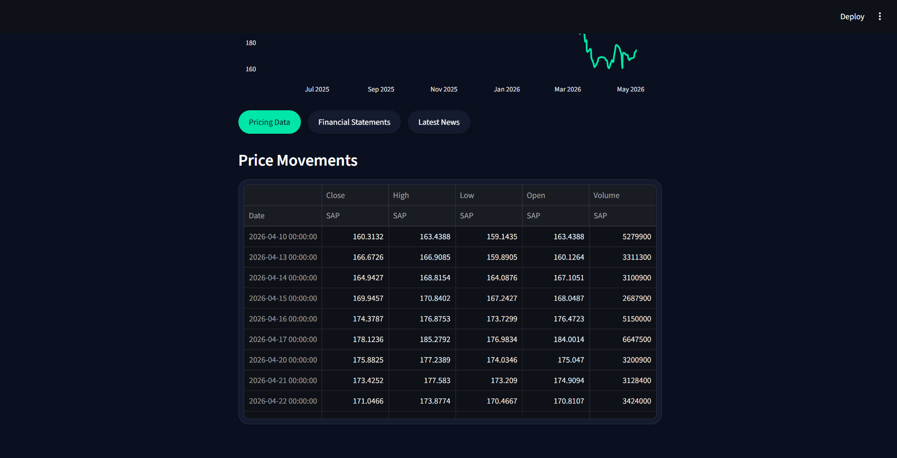
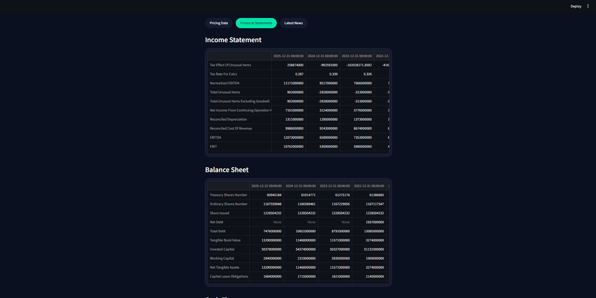
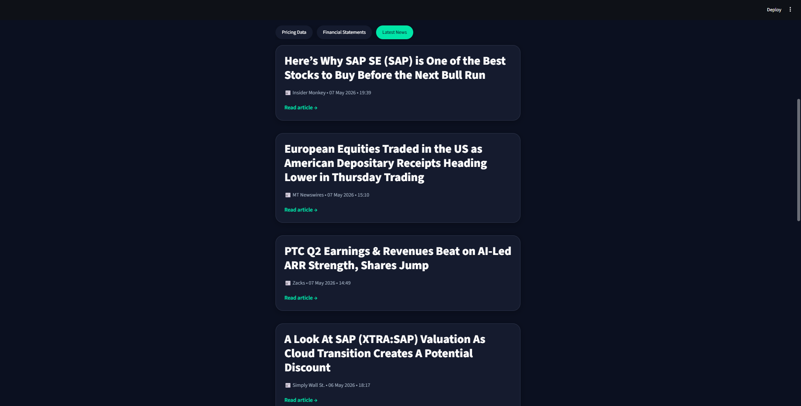

<<<<<<< HEAD
# Stock Dashboard

Interactive stock dashboard built with Streamlit, Plotly and yfinance.

## Features

- Company search
- Interactive stock charts
- Financial statements
- Latest news
- Multiple time periods

## Tech Stack

- Python
- Streamlit
- Plotly
- yfinance

## Run locally

```bash
pip install -r requirements.txt
streamlit run app.py
```
=======
# 📈 Streamlit Stock Dashboard

An interactive stock market dashboard built with Streamlit, Plotly, and yfinance to analyze stock prices, financial statements, and latest market news in a clean and modern interface.

This project helped me strengthen my skills in API integration, financial data analysis, dashboard development, and interactive data visualization using Python.

---

# 🎯 Project Objective

The goal of this project is to create a responsive and user-friendly stock analysis dashboard that allows users to:

* Search companies by ticker or name
* Analyze stock price performance across multiple time periods
* Track profit/loss changes
* Explore financial statements
* Read the latest company news
* Practice financial data visualization and dashboard design

---

# ⚙️ Features

* Company search with Yahoo Finance API
* Interactive stock price chart
* Multiple time periods:

  * 1D
  * 5D
  * 1MO
  * 6MO
  * 1Y
  * 5Y
  * MAX
* Profit & Loss calculations
* Financial Statements:

  * Income Statement
  * Balance Sheet
  * Cash Flow
* Latest company news
* Dark-themed responsive UI

---

# 📊 Dashboard Overview

The dashboard includes:

* Interactive stock price visualization
* Dynamic date navigation
* Hover analytics with P&L metrics
* Financial reporting tables
* News cards with publication details
* Responsive layout and custom styling

---

# 🛠 Tech Stack

## Tools & Libraries

* Python
* Streamlit
* Plotly
* yfinance
* Requests
* Dateutil

## Skills Demonstrated

* API Integration
* Financial Data Analysis
* Interactive Dashboards
* Data Visualization
* State Management
* Error Handling
* UI Styling
* Python Development

---

# 📸 Screenshots

## Main Dashboard



## Pricing Data



## Financial Statements



## Latest News




---

# 🚀 Run Locally

```bash
pip install -r requirements.txt
streamlit run app.py
```

---

# 🧠 Final Conclusion

This project improved my understanding of:

* Financial market data processing
* Interactive dashboard development
* Data visualization techniques
* Working with external APIs
* Building user-focused analytical applications

It also helped me practice transforming raw financial data into a clean and interactive dashboard experience.
